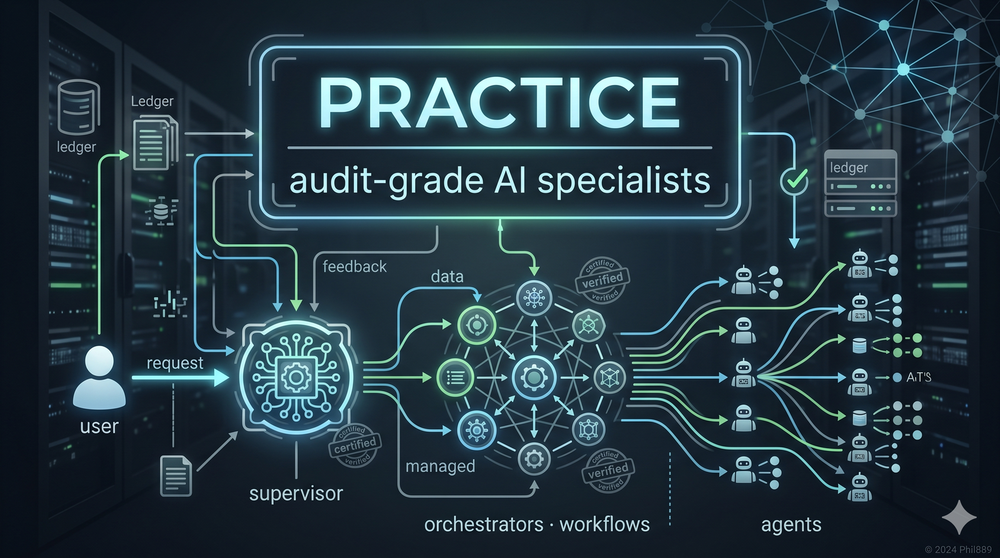

<div align="center">



# practice

**AI specialists tailored to your project.**
**They catch themselves when they're wrong.**
**A senior co-pilot keeps the standards while you ship fast.**

[](https://claude.com/claude-code)
[](LICENSE)
[]()
[](#-quick-start)

[Quick start](#-quick-start) · [Why practice](#-why-practice) · [Architecture](#-the-four-tier-architecture) · [Worked example](#-worked-example) · [Companion tools](#-companion-tools) · [Honest limits](#-honest-limits) · [Roadmap](#-roadmap)

</div>

---

## ⚡ Quick start

> **Requires** [Claude Code](https://claude.com/claude-code) (CLI, desktop, web, or IDE) and a git repo.

```bash
# One liner — installs the harness in your project:
npx github:Phil889/practice init

# Or with the companion skill + browser bridge pre-wired:
npx github:Phil889/practice init --all
```

Then in Claude Code, in your project root:

```
> /init
```

`/init` reads your codebase, asks 5–7 targeted questions, proposes a tailored specialist team, and scaffolds the harness. **You're shipping verified work in ~10 minutes.**

<details>
<summary><b>Manual install (alternative)</b></summary>

```bash
git clone https://github.com/Phil889/practice .practice
.practice/install.sh
# then in Claude Code: > /init
```

</details>

<details>
<summary><b>Sanity-check or repair an existing install</b></summary>

```bash
npx github:Phil889/practice doctor       # diagnose
npx github:Phil889/practice init --upgrade   # refresh templates
```

</details>

---

## 🤔 Why practice

Most agentic frameworks let agents talk to each other. None of them ground the conversation in **inspectable evidence** with a **verifier loop** — so they confidently ship work that's wrong.

In `practice`, every specialist must:

| Discipline | What it means |
|---|---|
| **Cite `file:line`** for every claim | They read the code, not hallucinate it |
| **Attach a `verifiable_outcome`** SQL or probe to every finding | Claims are re-runnable |
| **Pass an `audit-verifier`** QA layer before work ships | Sloppy runs fail |
| **Be checked by a `supervisor`** between heavy runs | Drift caught early |

The result: **agents that catch themselves.**

> #### Real moment from a recent run
>
> > *"Phase 2 complete. Critical adaptation: designer found there's no `/suppliers/[id]` route — supplier detail is a Sheet, so spec adapted accordingly. 8 atomic build IDs delivered."*
>
> The designer was about to ship a spec for a route that didn't exist. It hit the codebase, discovered the assumption was wrong, and **rewrote the spec instead of producing dead code.** That's the moat.

---

## 🧭 Your AI co-pilot: the supervisor

`practice` doesn't just give you specialists. It gives you a **senior co-pilot who runs them on your behalf.**

The supervisor sits at the top of the harness. **You talk to it. It coordinates everything else.**

```
> /supervisor mode: snapshot

SYSTEM PULSE — 2026-04-26 14:22 UTC
  Latest run:        build-loop · GREEN · 47 min
  Backlog:           0 P0 · 3 P1 · 2 deferred · 0 escalated
  HSI iteration:     5/5 verified · 0 regressed
  Posture:           GREEN · all P0 verifiable_outcomes reproduce live

NEXT MOVE
  Recommended: /release-readiness, then push
  Why:         GREEN posture + 5 unpushed commits + audit-trail clean
  Effort:      S (~10 min)
```

Or just ask it directly:

```
> /supervisor mode: talk: should we ship the audits module next, or fix
                          the escalated F-007 first?

F-007 first. It's a P0 RLS gap touching the same schema audits would land
on — shipping audits now would force a re-verify of every audit finding
once F-007 ships anyway. F-007 is S-effort (~30 min); audits is M (1–2
days). The cheaper sequence is F-007 → audits.

NEXT MOVE
  Recommended: /build-loop scope: ship-cluster:F-007
  Why:         dependency ordering · single-finding cluster · within effort-cap
```

The supervisor reads your `SESSION-LOG.md` end-to-end on every call, so it has **continuity across sessions** — you never have to remember where you left off. It refuses to declare GREEN when it should be AMBER. It surfaces only the decisions that genuinely need you, hiding everything automation already settled.

> **Describe what you need. Approve what it ships. Redirect when it drifts.**
>
> That's the loop. You stay in command, the standards stay high, and the work product compounds every week. **You manage.**

---

## 🛠️ Workflows: one command, audit-grade chains

Common multi-step recipes are bundled as workflows. One slash-command runs the full chain end-to-end with a GO/NO-GO gate.

| Workflow | When to run | What it chains |
|---|---|---|
| `/release-readiness` | After implementing, before push | tester re-run → audit-orchestrator release-scan → supervisor pre-push → GO/NO-GO + push command |
| `/audit-and-ship` | Per-module weekly cycle | module-deep-dive → audit-verifier → build-loop ship → release-readiness |
| `/weekly-review` | End of every week | supervisor weekly-review → backlog burn → roadmap drift → next-week plan |
| `/incident-response` | When production breaks | qa-engineer pattern scan → build-loop ship-cluster → release-readiness → post-incident review |
| `/feature-launch` | Per new feature | feature-design → build-loop ship → release-readiness → supervisor pre-push |

Workflows live in `.claude/workflows/` and are **fully editable**. Add your own — the supervisor picks them up automatically and surfaces them in its "next move" recommendations when triggers match.

---

## 🎯 What `practice` is for

`practice` works for any **evidence-grounded knowledge team** — work where the output is an inspectable artefact (code, report, decision, plan) and you can re-run a check on it.

| Domain | Example specialists `/init` will scaffold |
|---|---|
| **Software engineering** | qa-engineer · architecture-auditor · security-reviewer · implementer · tester |
| **Compliance & audit** | regulatory-officer · workflow-architect · control-tester · risk-modeler |
| **Legal due diligence** | corporate-counsel · ip-counsel · tax-specialist · contract-reviewer |
| **Investment research** | sector-analyst · macro-strategist · competitor-mapper · risk-officer |
| **Investigative journalism** | investigator · fact-checker · source-validator · legal-reviewer |
| **Medical literature review** | study-screener · methodology-critic · biostatistician · evidence-synthesiser |
| **Academic research** | literature-mapper · methodology-designer · replication-checker |
| **Product management** | user-researcher · market-analyst · competitive-mapper · feasibility-officer |

Specialists are **generated for your domain** when you run `/init`. They are not a fixed set.

---

## 🔌 Companion tools

The harness leans on two upstream tools. Both install in one shot via the `--all` flag — or manually if you prefer.

### Karpathy guidelines — implementer discipline

[](https://github.com/forrestchang/andrej-karpathy-skills)

Encodes Andrej Karpathy's rules for keeping LLM-driven coding *surgical* — no over-engineering, no half-finished implementations, no speculative abstractions. The `practice` `implementer` agent works best when this skill is loaded; the supervisor's handover docs assume it's available.

```bash
# Auto-install:
npx github:Phil889/practice init --with-karpathy

# Manual:
git clone https://github.com/forrestchang/andrej-karpathy-skills \
  ~/.claude/plugins/andrej-karpathy-skills
```

Trigger anywhere with `/karpathy-guidelines` — or let the harness invoke it when shipping a finding.

### Playwriter — your browser as a stateful sandbox

[](https://github.com/remorses/playwriter) [](https://playwriter.dev/)

The load-bearing browser tool for the harness's **render-layer UAT mandate** (the `tester` agent's playwriter block; the supervisor's `mode: uat-sweep`). Runs Playwright snippets in a stateful local JS sandbox and drives **your own logged-in Chrome** via a browser extension — so the agent verifies post-login flows without re-authenticating.

```bash
# Auto-install:
npx github:Phil889/practice init --with-playwriter

# Manual:
npm install -g playwriter
playwriter install              # installs the Chrome extension
playwriter skill                # prints the latest skill spec for Claude Code
```

Without `playwriter`, render-layer findings can't earn a `playwriter-uat: PASS` field on the commit — and the verifier flags them as unverified.

---

## 🏛️ The four-tier architecture

Each tier has one job, and the boundaries are **structural** — you can't accidentally call them the wrong way.

```
        ┌────────────────────────────────────────────────────┐
        │  USER  (project lead, decision-maker)               │
        └────────────────────────┬───────────────────────────┘
                                 │ talks to
                                 ▼
        ┌────────────────────────────────────────────────────┐
        │  SUPERVISOR  (skill — your co-pilot)                │
        │  · tracks progress across sessions                  │
        │  · keeps standards · surfaces decisions             │
        │  · recommends the next move with justification      │
        └────────────────────────┬───────────────────────────┘
                                 │ steers + monitors
                                 ▼
   ┌────────────────────────────────────────────────────────────┐
   │  WORKFLOWS + ORCHESTRATORS  (skills, parent-session)        │
   │                                                              │
   │  /release-readiness  /audit-and-ship  /weekly-review         │
   │  /incident-response  /feature-launch                         │
   │                                                              │
   │  /audit-orchestrator   /build-loop                           │
   └────────────────────────┬───────────────────────────────────┘
                            │ dispatches via Agent tool
                            ▼
   ┌────────────────────────────────────────────────────────────┐
   │  LEAF AGENTS  (subagents — pure workers)                    │
   │                                                              │
   │  <your-domain-specialists>   qa-engineer    designer         │
   │  audit-verifier  (QA on the audit team itself)               │
   │  implementer · tester  (build pair)                          │
   └────────────────────────────────────────────────────────────┘
```

> **Why the split is load-bearing:** Claude Code's subagent runtime drops the `Agent` tool from spawned subagents. An orchestrator running as a subagent can't dispatch its peers and returns useless. By making orchestrators **skills** (parent-session) and specialists **agents** (subagents), `practice` makes the boundary structural.
>
> This took a real production incident to discover. **You inherit the fix.**

---

## 📦 Worked example: ship-and-release in two commands

```bash
# 1. Ship the cluster — implementer + tester run per finding
> /build-loop scope: ship-cluster:F-001,F-002,F-003
```

> Three atomic commits land on `dev`. Each finding re-verified live before commit; commit messages cite finding-id, audit-slug, `verifiable_outcome` pre/post, regression-check, and driver. **All PASS.**

```bash
# 2. Confirm release-readiness — one workflow, four phases
> /release-readiness
```

> **Phase 1.** Tester re-runs every shipped `verifiable_outcome` against current branch state.
> **Phase 2.** Audit-orchestrator release-scan scoped to touched modules.
> **Phase 3.** Supervisor pre-push: convention compliance + audit-trail integrity + 3 live-state probes.
> **Phase 4.** GO/NO-GO verdict.

```
VERDICT: GO

3 findings re-verified live · audit-orchestrator: PASS-WITH-WARNINGS
Supervisor pre-push: GREEN · all commit messages compliant

→ git push origin dev
```

That's it. **Two commands. Three verified, atomic-committed fixes. A live re-run of every verifiable outcome. A complete audit trail in `git log --grep`.** Push-ready.

When you want to talk through what's next:

```
> /supervisor mode: talk: what should we tackle this week?
```

The supervisor synthesises across `SESSION-LOG.md`, your roadmap, and the open backlog, recommending with citations. **You don't read 5 reports — you have one conversation.**

---

## 🧰 Customising for your domain

After `/init` runs, your project has:

```
.claude/
  skills/
    audit-orchestrator/SKILL.md     ← multi-specialist audits
    build-loop/SKILL.md              ← ship findings with rigour
    supervisor/SKILL.md              ← your co-pilot
    init/SKILL.md                    ← re-run on demand
  workflows/
    release-readiness.md             ← post-implementation gate
    audit-and-ship.md                ← per-module weekly cycle
    weekly-review.md                 ← Friday/Monday ritual
    incident-response.md             ← when production breaks
    feature-launch.md                ← per new feature
  agents/
    <your-domain-specialists>.md    ← generated by /init
    qa-engineer.md                   ← universal
    audit-verifier.md                ← universal QA layer
    implementer.md                   ← universal builder
    tester.md                        ← universal verifier
.planning/
  audits/
    _context/                        ← codebase summary, periodically refreshed
    _findings-status/                ← per-finding tracking + briefs
    SESSION-LOG.md                   ← append-only session record
  SYSTEM-CHANGELOG.md                ← HSI iteration log (the harness self-improves)
```

Edit any file. Add new specialists. Add new workflows. Tune the quality bar in `.planning/audits/_context/quality-bar.md`. **The harness is yours** — `practice` is the starting craft, not a runtime you depend on.

---

## 🧬 The harness gets smarter every run

Every session writes hypotheses to `SYSTEM-CHANGELOG.md` (HSI-001, HSI-002…) — *"if we do X, the system improves Y"* — with a verification probe. The supervisor flips each HSI's status to **VERIFIED** / **REFUTED** / **INCONCLUSIVE** the next time the relevant evidence comes in. Refuted hypotheses spawn replacement HSIs.

You're not just running an agentic harness. You're running one that **measures itself, learns, and tells you when it drifted.** The compounding is the product.

> **Context hygiene is built in.** Old VERIFIED HSIs auto-archive after 14 days of stability. Session-logs roll up monthly. Closed findings move to `_archive/` 30 days post-PASS. The supervisor's working set stays under a token budget defined in [`templates/planning/HYGIENE-POLICY.md`](templates/planning/HYGIENE-POLICY.md). `/supervisor mode: hygiene` runs the pass when soft caps trip; the supervisor refuses heavy playbooks if any hard cap is breached. **The compounding doesn't decay into bloat.**

---

## ⚖️ Honest limits

`practice` is a **strong fit** when:

- ✅ Output is an inspectable artefact (code, report, plan, decision)
- ✅ Claims can be checked by re-running something (SQL, test, lint, lookup, citation check)
- ✅ Multiple specialist perspectives genuinely add value

It is a **weaker fit** for:

- ❌ Real-time conversations (sales, support, live chat)
- ❌ Pure creative judgment ("is this prose beautiful?")
- ❌ Single-perspective tasks that don't need a team

Don't force it where it doesn't fit. **The audit-grade rigour is the value — not the multi-agent ceremony.**

---

## 🆚 What `practice` replaces

| Tool you might be using | What `practice` swaps in |
|---|---|
| **CrewAI / AutoGen / LangGraph** | Evidence-grounded specialists with a verifier loop, audit trail, and a co-pilot |
| **Cursor agent / Copilot Workspace** | Multi-perspective specialist review with a quality bar, not single-agent edits |
| **Bare-prompt Claude / ChatGPT** | A standards-keeping co-pilot, an evidence trail, and a self-catching loop |
| **A four-contractor code audit** | Same coverage, re-runnable evidence, days instead of weeks |

`practice` doesn't compete on speed. It competes on **trust in the work product** — and on **how much of the steering you can hand off without losing rigour.**

---

## 👁️ See it in action

The repo's [`examples/`](examples/) directory has anonymised real runs from a project running `practice` in production — not synthetic demos.

The most-instructive one: [`examples/hsi-self-improvement.md`](examples/hsi-self-improvement.md) walks through a real HSI iteration where the deterministic verifier was producing **100% false-FAILs across four audit playbooks**. The supervisor proposed HSI-006, classified the bug into 10 testable defects (D1–D10), shipped one atomic commit, and verified the fix on disk against all four runs. Result: **false-FAIL rate 100% → 0%**, status flipped to `✅ HYPOTHESIS-VERIFIED` in `SYSTEM-CHANGELOG.md`. **The supervisor refused to claim clean PASS** — the post-fix runs still had 1–2 nits in report content, and the verification block names them explicitly. *That's the kind of self-honesty the harness preaches.*

---

## 🌱 Origins

`practice` is the harness extracted from a production **advanced compliance-based company-management application** — a multi-norm platform where 9 specialist agents, 4 orchestrator skills, 5 workflows, and an evidence-grounded loop have shipped audited compliance work for ISO 9001, 14001, 45001, 27001, and GDPR since early 2026.

In the first marathon session of harness use, the system:
- Audited its own foundation across 6 specialists in parallel
- Cluster-shipped 7 of 10 P0/P1 findings
- Caught itself adapting specs to reality (the `designer` agent discovered no `/suppliers/[id]` route existed and rewrote the spec mid-Phase-2)
- Ran the HSI loop captured in [`examples/hsi-self-improvement.md`](examples/hsi-self-improvement.md) — six self-improvement iterations, all VERIFIED on disk

**The pattern is real. It's not a research project. It ships.**

---

## 🗺️ Roadmap

- [x] Four-tier architecture with structural enforcement
- [x] Audit → ship → verify → supervise loop
- [x] Evidence-grounded specialists (file:line + verifiable_outcome)
- [x] Workflows as a first-class concept (5 shipped recipes)
- [x] Supervisor as project-management partner with cross-session memory
- [x] HSI self-improvement loop (SYSTEM-CHANGELOG)
- [x] `audit-verifier` QA layer
- [x] Commit-message convention auditing
- [x] Render-layer UAT mandate via Playwriter (HSI-028)
- [x] `npx` one-line install with companion-tool flags
- [ ] **`/init` for any codebase** (in progress)
- [ ] Domain templates (legal, research, journalism, finance)
- [ ] Multi-language codebase support (Python, TS, Go, Rust, Ruby)
- [ ] Browser-based dashboard for `.planning/` artefacts
- [ ] Cross-project specialist library

---

## 🤝 Contributing

`practice` evolves through the same discipline it preaches: every change ships as an HSI ([SYSTEM-CHANGELOG entry](templates/planning/SYSTEM-CHANGELOG.md)) with a falsifier and a verification probe. See [CONTRIBUTING.md](CONTRIBUTING.md) for how to propose one.

Bug reports, real-run examples, and domain templates are all welcome. The bar is the same as the harness: **citations + verifiable outcome + honest confidence.**

---

## 📜 License

MIT. Use it, fork it, ship with it. If `practice` ships work for you, [tell us where](https://github.com/Phil889/practice/discussions) — we want to see what the harness does in domains we haven't tried.

---

## 🛠️ Built with

[Claude Code](https://claude.com/claude-code) — Anthropic's official CLI for Claude.

Companion tools that make the harness work in production:
- [Karpathy guidelines skill](https://github.com/forrestchang/andrej-karpathy-skills) — implementer discipline
- [Playwriter](https://github.com/remorses/playwriter) ([playwriter.dev](https://playwriter.dev/)) — stateful browser bridge for tester / uat-sweep

---

<div align="center">

**Stop letting your agents lie to you confidently.**
**Stop reading every report.**
**Stop building every step yourself.**

**Describe. Approve. Redirect. Open a `practice`.**
**Human in the loop, not in the weeds.**

<br>

<a href="#-quick-start">⚡ Get started in 60 seconds →</a>

</div>
